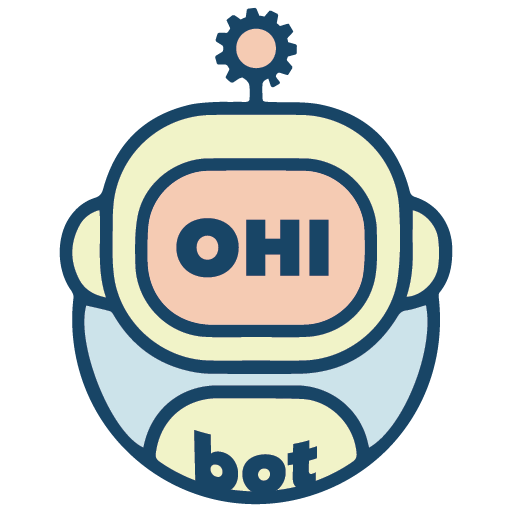

<p align="center">
  
</p>

<p align="center">
  The perfect JavaScript library for your scripted chatbot 🤖
</p>

## Usage

```javascript
// import the personality file
import { default as personality } from '/src/assets/personalities/samplebot/samplebot.js'

// create a new ohibot instance (with or without speech synthesis capabilities)
const { Ohibot, SpeechSynthesisOhibot } = ohibot
const samplebot = new SpeechSynthesisOhibot(new Ohibot(personality))

samplebot.introduce().then(response => {
  // handle the response in some way
  const pre = document.createElement('pre')
  document.body.appendChild(pre)
  pre.innerHTML = JSON.stringify(response, null, 2)
})

samplebot.process('Aiuto').then(response => {
  // handle the response in some way
  const pre = document.createElement('pre')
  document.body.appendChild(pre)
  pre.innerHTML = JSON.stringify(response, null, 2)
})
```

Try it out by serving the [index.html](index.html) file through a simple http server.

## Personality

A personality file is needed in order to create a new ohibot instance.

The structure of the personality file must follow the guidelines specified by the [samplebot.js](src/assets/samplebot/samplebot.js) file.

A personality file is a JavaScript file which exports a default object with the following keys:

- `introduction`
- `logics`

### Introduction

An array containing the ohibot welcome message(s).

### Logics

An array contaning the ohibot logics, that is the way the ohibot reacts to the requests.
Each `logics` item, a logic, is an object with the following properties:

- `question`
- `triggers`
- `answer`
- `action` (optional)
- `groups` (optional)

#### Question

A string referring to an example of request that will trigger the logic.

#### Triggers

An array of arrays containing the current logic keyword combinations (case insensitive) that will trigger the logic.

#### Answer

An array of objects defining the ohibot response for a request that triggers a given logic.

#### Actions and groups

An action is an object with the following properties:

- `name``
- `filterable`: a boolean, useful only from a UI perspective, that specify if the actions elements can either be filtered or not

A group is an array made up of objects with the following properties:

- `name`: the name of the action they refer to
- `label` the label of the current logic when shown through an action.

Let's take into consideration the following personality:

```javascript
export default {
  introduction: [
    { type: 'text', content: 'Hey!' }
  },
  logics: [
    {
      question: `What's your phone number?`,
      triggers: [['phone', 'number']],
      answer: [{ type: 'text', content: 'My phone numbers' }],
      action: { name: 'phone', filterable: true }
    },
    {
      question: `What's your home phone number?`,
      triggers: [['home', 'phone']],
      answer: [{ type: 'text', content: '0123 45678' }],
      groups: [{ name: 'phone', label: 'Home' }]
    },
    {
      question: `What's your mobile phone number?`,
      triggers: [['mobile', 'phone']],
      answer: [{ type: 'text', content: '012 3456789' }],
      groups: [{ name: 'phone', label: 'Mobile' }]
    }
  ]
},
```

If the request would be `What's your phone number?` the response will be

```json
{
  "question": "What's your phone number?",
  "triggers": "\\bphone\\b.*\\bnumber\\b",
  "answer": [
    {
      "type": "text",
      "content": "My phone numbers"
    }
  ],
  "action": {
    "items": [
      {
        "label": "Home",
        "question": "What's your home phone number?"
      },
      {
        "label": "Mobile",
        "question": "What's your mobile phone number?"
      }
    ],
    "filterable": false
  }
}
```

This will allow you to define logics hierarchies and, from a UI perspective, presenting a list of questions that can be directly used to make new requests.

## Running the tests

You can run the tests with the following command

```
npm run test
```

Tests will be automatically run before the `dist` task.

## Distribution

You can distribute the last version of the library by typing

```
npm run dist
```

In the `dist` folder you will find the following versions

- CommonJS: `ohibotCore.cjs.js`
- ECMAScript Module: `ohibotCore.esm.js`
- Universal Module Definition: `ohibotCore.umd.js`
- Universal Module Definition (minified): `ohibotCore.umd.min.js`

## Built With

- [rollup.js](https://rollupjs.org) - The module bundler used
- [npm](https://www.npmjs.com) - The dependency manager
- [Babel](https://babeljs.io) - The JavaScript next generation compiler

## Authors

- **Luca Martini** - [LinkedIn](https://www.linkedin.com/in/lgmartini)

## License

This project is licensed under the MIT License - see the [LICENSE.md](LICENSE.md) file for details

## Acknowledgments

A special thanks to [Matteo Paletta](https://www.linkedin.com/in/matteopaletta) for the nicest logo ever.
